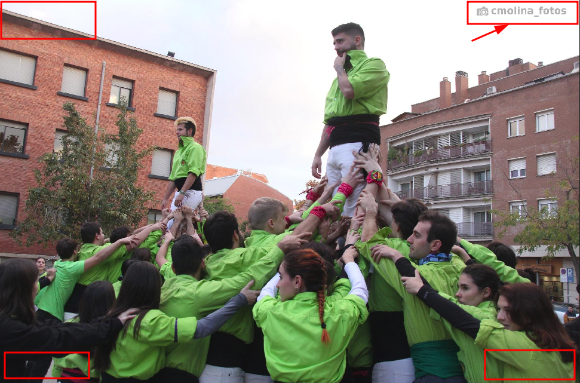

# photo_signature
A Python/OpenCV script that automatically puts a watermark or signature in the best corner, taking into account its brightness and contrast.

The code automatically runs over a bunch of photographs to overlay a semitransparent image in the corner of a larger image. The algorithm gives punctuation to each corner in terms of brightness and contrast in order to increase the readability of the watermark. Additionally, if the background is dark, the watermark is printed in white, and the other way around.

In this example image it can be seen how the algorithm selected the top-right corner of the image because it is the smoothest in terms of contrast, and according to the light brightness, the signature was printed in dark gray.

Carlos Molina, CC BY-SA 4.0
